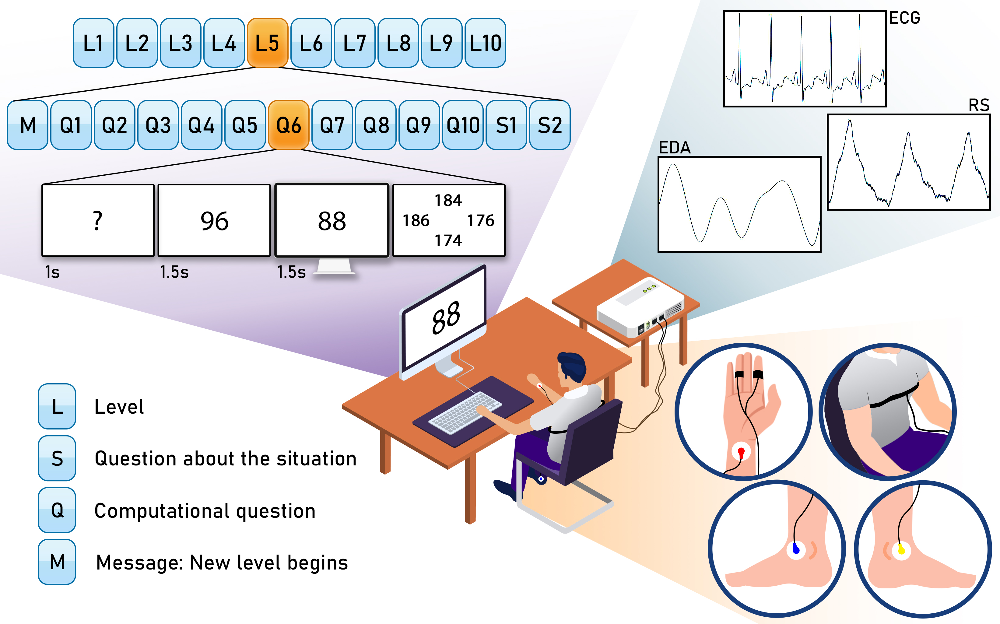
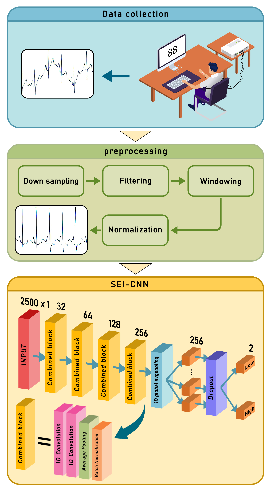
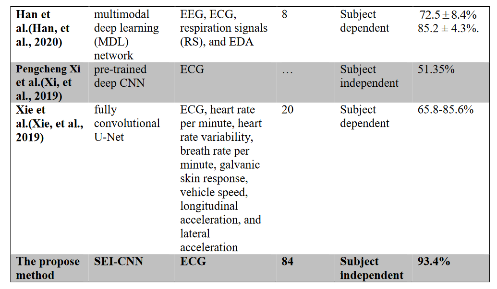

# Automatic-Cognitive-Workload-Estimation
Contemplate On ECG Signal And Enhanced Automatic Cognitive Workload Estimation Using CNN And A Hybrid CNN-LSTM Network 

SEI-CNN is a repository that introduces a novel approach for estimating cognitive workload using a Single Electrocardiogram Input Convolutional Neural Network. This method is designed to extract deep features and classify them into different workload levels. The performance of this method has been assessed and compared to other existing approaches in the domain of estimating cognitive workload.

- [Abstract](#abstract)
- [File Structure](#file-structure)
- [Setup and Installation](#setup-and-installation)
- [Method](#method)
- [Results](#results)
- [License](#license)

## Abstract
The project revolves around the development of a reliable, cost-effective, and automatic method for Cognitive Workload Estimation (CWE). The proposed methodology, CWE-SEI-CNN, employs a Single Electrocardiogram Input Convolutional Neural Network that demonstrates high accuracy and robustness, particularly under conditions involving mental fatigue interference.

Shima Mohammadi, Peyvand Ghaderian, Poorya Aghaomidi. "Contemplate On ECG Signal And Enhanced Automatic Cognitive Workload Estimation Using CNN And A Hybrid CNN-LSTM Network"

## File Structure
The repository is organized as follows:

- `Src`: Contains Python and MATLAB scripts for the main functionalities.
- `Docs`: Related documents

## Setup and Installation
1. Clone the repository: `git clone https://github.com/PooryaAghaomidi/Automatic-Cognitive-Workload-Estimation.git`
2. Install dependencies: `pip install -r requirements.txt`
3. Ensure proper setup for working with GPU (if needed).

## Method
Here is the algorithm for this project:

## Results
This section displays visualized results or performance metrics obtained from the trained models. Use the provided functions to embed images and share outcomes from the project.

Example result from model evaluation:

## License
If you find this repository useful for your research, please consider citing the associated paper.

